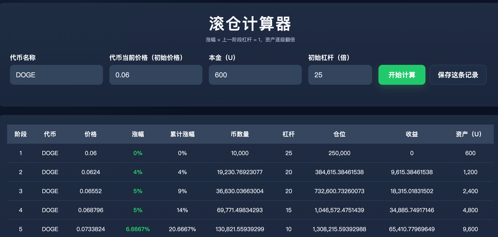

# 滚仓计算器



一个**纯前端、单文件、零依赖**的滚仓计算器：核心是「涨幅 × 上一阶段杠杆 = 1，资产逐级翻倍」的滚仓模型演示，并附带**本地历史记录**（计算快照保存与回退）和**实盘记录**（每笔操作盈亏台账与总收益统计）两大功能。

直接用浏览器打开 `outputs/滚仓计算器.html` 即可使用，无需安装、无需联网、无任何外部请求。

---

## 功能总览

### 1. 滚仓计算

输入 4 项参数，生成 12 个阶段的完整推演表格：

| 输入项 | 说明 | 示例默认值 |
| --- | --- | --- |
| 代币名称 | 自定义文本 | DOGE |
| 代币当前价格（初始价格） | 大于 0 的数字 | 0.06 |
| 本金（U） | 大于 0 的数字 | 600 |
| 初始杠杆（倍） | 大于 0 的数字 | 25 |

**模型规则**：

- 第 1 阶段用初始杠杆建仓；
- 之后每一级的涨幅自动按「1 ÷ 上一阶段杠杆」计算，使「涨幅 × 杠杆 = 1」；
- 因此每一阶段资产严格翻倍（如 25 倍起步：600 → 1,200 → 2,400 → …）；
- 第 2 级起杠杆按固定序列递减：`20 → 20 → 15 → 10 → 5 → 3 → 2 → 1 → 0.5 → 0.2 → 0.1`；
- 表格逐级展示：价格、涨幅、累计涨幅、币数量、杠杆、仓位、收益、资产（U），底部汇总最终资产与收益率。

### 2. 历史记录（本地保存 / 回退）

- 计算后点击「保存这条记录」，把**输入参数 + 完整结果快照**存入浏览器 localStorage；
- 历史面板常驻展示（可收起），按时间倒序，点击「查看 / 回退」一键回到当时的结果（显示当时快照，而非重新计算）；
- 删除 / 清空均为两次点击确认，防误删；
- 支持**导出 / 导入 JSON 备份**（自动去重合并），防止清缓存或换浏览器丢数据；
- 上限 100 条，超出自动淘汰最旧。

### 3. 实盘记录（盈亏台账）

- 每次实际操作后记录：**时间、代币、开仓位大小（U）、最终结果（U，盈利填正数、亏损填负数）、备注**（多行文本，记录当时的情况与总结）；
- 底部自动统计**操作笔数**与**总收益**（所有最终结果累加）；
- 盈利显示红色、亏损显示绿色（A股配色习惯）；
- 记录同样存本地，删除需二次确认。

---

## 快速开始

```bash
# 1. 克隆仓库
git clone https://github.com/wanghoufan/roll-position-calculator.git

# 2. 双击打开，或用浏览器访问
open outputs/滚仓计算器.html
```

无构建、无依赖、无网络请求。数据全部保存在浏览器 localStorage 中：

| 存储键 | 内容 | 容量上限 |
| --- | --- | --- |
| `rollcalc.history.v1` | 计算历史快照 | 100 条 |
| `rollcalc.trades.v1` | 实盘记录 | 500 条 |

> 注意：localStorage 跟随浏览器与域名。清缓存、换浏览器会导致数据丢失，请定期使用历史面板的「导出」功能备份 JSON。

---

## 校验脚本

`work/` 目录附带三套 Node 校验脚本（含 Playwright 浏览器实测）：

```bash
cd work

# 纯 Node 即可运行：校验计算模型与单文件约束（单内联脚本、零外部依赖）
npm install                # 安装依赖（仅校验脚本使用，与计算器本体无关）
node verify_calculator.mjs # 计算逻辑：逐级翻倍、币数量公式、截图场景回归

# 需要安装 Playwright 浏览器（npx playwright install chromium）
node verify_history.mjs    # 历史记录：保存/回退/持久化/删除确认/清空/收起展开/导出/导入
node verify_trades.mjs     # 实盘记录：添加/总收益累加/倒序/配色/持久化/移动端布局
```

---

## 技术实现

- **单 HTML 文件**（约 45KB）：HTML + CSS + 原生 JavaScript 全部内嵌，无框架、无构建、无网络请求，可离线使用；
- **存储**：浏览器 localStorage，读写均有异常兜底（如隐私模式下提示而非崩溃）；
- **响应式**：桌面表格布局，窄屏自动切换为卡片式布局（680px 断点），移动端无横向滚动。

---

## 免责声明

计算结果**未计入手续费、资金费率、滑点、强平风险与交易所交易规则**，仅用于滚仓模型的公式演示，**不构成任何投资建议**。高杠杆交易风险极高，请自行评估风险。
